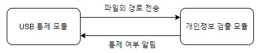

# 개방형 OS 내 기밀데이터 모니터링 및 통제 기술 개발
## (부제: 개방형 OS에서 USB 개인정보 유출 방지 시스템)

---

## 개요

본 연구에서 제안하는 개인정보 유출차단 시스템은 위 그림과 같이 USB를 통제하는 USB 통제 모듈과 파일을 검사하는 개인정보 검출 모듈로 구성된다. USB 통제 모듈은 USB의 장착을 인식하고 장착된 USB로의 파일 복사/이동 이벤트를 감시하는 기능을 한다. 개인정보 검출 모듈은 복사/이동된 파일에 대하여 검사를 진행하고 통제 여부를 결정하는 기능을 한다.

---
## 실행 방법

업데이트 예정

---
## 시연 영상

업데이트 예정

---
## 논문

학회: 한국정보과학회
제목: 개방형 OS에서 USB 개인정보 유출 방지 시스템
저자: 현상엽 유준모 김규민 안종석
링크: 업데이트 예정

